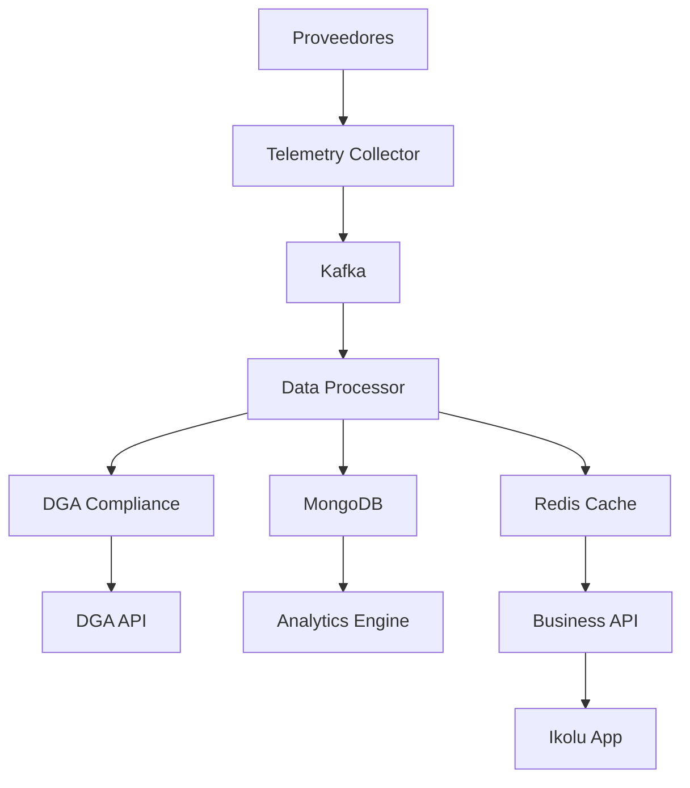

# SmartHydro 2.0 - Microservicios

## 🎯 **Visión General**

SmartHydro 2.0 es una arquitectura de microservicios de nivel mundial para el monitoreo y gestión de recursos hídricos. Diseñada para manejar **1000+ puntos de captación** con alta disponibilidad, escalabilidad y rendimiento excepcional.

## 🏗️ **Arquitectura de Microservicios**

### **Servicios Principales**

| Servicio                | Puerto | Tecnología | Responsabilidad                     |
| ----------------------- | ------ | ---------- | ----------------------------------- |
| **Telemetry Collector** | 8001   | FastAPI    | Recolección de datos de proveedores |
| **DGA Compliance**      | 8002   | FastAPI    | Cumplimiento normativo DGA          |
| **Data Processor**      | 8003   | FastAPI    | Procesamiento y validación          |
| **Business API**        | 8004   | Django/DRF | Gestión de negocio                  |
| **Analytics Engine**    | 8005   | FastAPI    | Análisis y reportes                 |

### **Infraestructura**

| Componente        | Tecnología           | Propósito                     |
| ----------------- | -------------------- | ----------------------------- |
| **Base de Datos** | PostgreSQL + MongoDB | Datos de negocio + mediciones |
| **Cache**         | Redis                | Cache + real-time             |
| **Message Queue** | Kafka                | Event streaming               |
| **Monitoring**    | Prometheus + Grafana | Métricas y dashboards         |
| **Orchestration** | Kubernetes           | Escalabilidad y gestión       |

## 🚀 **Inicio Rápido**

### **Prerrequisitos**

- Docker Desktop
- Docker Compose
- 8GB RAM mínimo
- 4 cores CPU mínimo

### **Despliegue Local**

```bash
# Clonar repositorio
git clone https://github.com/your-org/smarthydro-microservices.git
cd smarthydro-microservices

# Configurar variables de entorno
cp .env.example .env
# Editar .env con tus credenciales

# Iniciar servicios
./scripts/start.sh

# Verificar despliegue
docker-compose ps
```

### **Acceso a Servicios**

- 📊 **Grafana**: http://localhost:3000 (admin/admin)
- 📈 **Prometheus**: http://localhost:9090
- 🔌 **Business API**: http://localhost:8004
- 📡 **Telemetry Collector**: http://localhost:8001
- 🗄️ **PostgreSQL**: localhost:5432
- 🔴 **Redis**: localhost:6379
- 📊 **MongoDB**: localhost:27017

## 📚 **Documentación Completa**

### **📖 Guías de Arquitectura**

- [🏗️ Arquitectura de Microservicios](docs/ARCHITECTURE.md)
- [🔧 Integración de Proveedores](docs/PROVIDER_INTEGRATION.md)
- [🐳 Configuración Docker](docs/DOCKER_SETUP.md)
- [☸️ Migración Kubernetes](docs/KUBERNETES_MIGRATION.md)

### **🚀 Guías de Despliegue**

- [📦 Despliegue Local](docs/DEPLOYMENT_LOCAL.md)
- [☁️ Despliegue Producción](docs/DEPLOYMENT_PRODUCTION.md)
- [🔧 Configuración Avanzada](docs/ADVANCED_CONFIG.md)

### **🔍 Guías de Monitoreo**

- [📊 Métricas y Alertas](docs/MONITORING.md)
- [🔍 Troubleshooting](docs/TROUBLESHOOTING.md)
- [📈 Performance Tuning](docs/PERFORMANCE.md)

## 🔧 **Configuración de Proveedores**

### **Agregar Nuevo Proveedor**

```python
# 1. Crear clase del proveedor
class CustomProvider(BaseProvider):
    async def authenticate(self) -> bool:
        # Implementar autenticación
        pass

    async def get_data(self, point_config: Dict[str, Any]) -> Dict[str, Any]:
        # Implementar obtención de datos
        pass

# 2. Registrar en providers/__init__.py
PROVIDERS = {
    'custom': CustomProvider
}

# 3. Configurar en config/providers.yaml
providers:
  custom:
    name: "Custom Provider"
    base_url: "https://api.customprovider.com"
```

### **Proveedores Soportados**

- ✅ **Twin Data** - Telemetría IoT
- ✅ **Nettra** - The Things Network
- ✅ **Novus** - Tago.io
- 🔄 **Custom** - Proveedores personalizados

## 📊 **Performance y Escalabilidad**

### **Métricas Objetivo**

- **Latencia**: < 100ms (telemetría), < 200ms (API)
- **Throughput**: 100,000 mediciones/hora
- **Disponibilidad**: 99.9% uptime
- **Escalabilidad**: Auto-scaling horizontal

### **Recursos por Servicio**

```yaml
Telemetry Collector:
  - CPU: 2 cores
  - Memory: 4GB
  - Replicas: 3-10

Data Processor:
  - CPU: 2 cores
  - Memory: 4GB
  - Replicas: 3-8

Business API:
  - CPU: 1 core
  - Memory: 2GB
  - Replicas: 2-5
```

## 🔒 **Seguridad**

### **Autenticación**

- JWT tokens para APIs
- OAuth 2.0 para proveedores
- API keys para servicios internos

### **Autorización**

- RBAC (Role-Based Access Control)
- Service-to-service authentication
- Network policies

### **Protección de Datos**

- Encryption at rest
- Encryption in transit (TLS)
- Data anonymization
- Audit logging

## 🚀 **APIs**

### **Telemetry Collector API**

```yaml
GET /health                    # Health check
GET /providers                 # Lista proveedores
POST /collect/{provider}       # Recolectar datos
GET /status/{provider}         # Estado proveedor
```

### **Business API**

```yaml
GET /api/v1/clients/           # Lista clientes
POST /api/v1/clients/          # Crear cliente
GET /api/v1/points/            # Lista puntos
POST /api/v1/points/           # Crear punto
PUT /api/v1/points/{id}/config # Configurar punto
GET /api/v1/modules/           # Módulos disponibles
POST /api/v1/notifications/    # Crear notificación
```

### **Analytics API**

```yaml
GET /api/v1/analytics/points/{id}/history    # Histórico
GET /api/v1/analytics/points/{id}/realtime   # Tiempo real
POST /api/v1/analytics/reports               # Generar reporte
GET /api/v1/analytics/anomalies              # Anomalías
```

## 🔄 **Flujo de Datos**



## 🛠️ **Comandos Útiles**

### **Gestión de Servicios**

```bash
# Iniciar todos los servicios
docker-compose up -d

# Ver logs en tiempo real
docker-compose logs -f

# Reiniciar servicio específico
docker-compose restart telemetry-collector

# Ver uso de recursos
docker stats
```

### **Base de Datos**

```bash
# Conectar a PostgreSQL
docker-compose exec postgres psql -U smarthydro -d smarthydro_business

# Conectar a MongoDB
docker-compose exec mongodb mongosh -u smarthydro -p

# Conectar a Redis
docker-compose exec redis redis-cli
```

### **Monitoreo**

```bash
# Ver health checks
docker-compose ps

# Ver métricas Prometheus
curl http://localhost:9090/api/v1/targets

# Ver dashboards Grafana
open http://localhost:3000
```

## 🔧 **Troubleshooting**

### **Problemas Comunes**

#### **1. Puerto ya en uso**

```bash
# Ver qué está usando el puerto
lsof -i :8001

# Matar proceso
kill -9 <PID>
```

#### **2. Problemas de memoria**

```bash
# Ver uso de memoria
docker stats

# Limpiar recursos no usados
docker system prune -a
```

#### **3. Problemas de red**

```bash
# Ver redes Docker
docker network ls

# Inspeccionar red
docker network inspect smarthydro_default
```

## 📈 **Roadmap**

### **Fase 1: MVP (Completado)**

- ✅ Arquitectura de microservicios
- ✅ Integración de proveedores
- ✅ Configuración Docker
- ✅ Monitoreo básico

### **Fase 2: Producción (En Progreso)**

- 🔄 Migración a Kubernetes
- 🔄 CI/CD pipeline
- 🔄 Backup automático
- 🔄 Alertas avanzadas

### **Fase 3: Escalabilidad (Planificado)**

- 📋 Machine Learning
- 📋 Análisis predictivo
- 📋 Integración IoT avanzada
- 📋 API GraphQL

### **Fase 4: Enterprise (Futuro)**

- 📋 Multi-tenancy
- 📋 Federación de datos
- 📋 Integración blockchain
- 📋 IA avanzada

## 🤝 **Contribución**

### **Desarrollo Local**

```bash
# Fork del repositorio
git clone https://github.com/your-fork/smarthydro-microservices.git

# Crear rama de feature
git checkout -b feature/nuevo-proveedor

# Hacer cambios y commits
git add .
git commit -m "feat: agregar nuevo proveedor"

# Push y crear Pull Request
git push origin feature/nuevo-proveedor
```

### **Estándares de Código**

- **Python**: PEP 8, type hints, docstrings
- **API**: OpenAPI 3.0, RESTful design
- **Testing**: pytest, coverage > 90%
- **Documentación**: Markdown, docstrings

## 📞 **Soporte**

### **Canales de Ayuda**

- 📧 **Email**: support@smarthydro.com
- 💬 **Slack**: #smarthydro-support
- 📖 **Documentación**: [docs.smarthydro.com](https://docs.smarthydro.com)
- 🐛 **Issues**: [GitHub Issues](https://github.com/your-org/smarthydro-microservices/issues)

### **Comunidad**

- 🌐 **Website**: [smarthydro.com](https://smarthydro.com)
- 📺 **YouTube**: [SmartHydro Channel](https://youtube.com/smarthydro)
- 🐦 **Twitter**: [@SmartHydro](https://twitter.com/SmartHydro)
- 💼 **LinkedIn**: [SmartHydro](https://linkedin.com/company/smarthydro)

## 📄 **Licencia**

Este proyecto está bajo la Licencia MIT. Ver el archivo [LICENSE](LICENSE) para más detalles.

## 🙏 **Agradecimientos**

- **DGA** - Dirección General de Aguas
- **Twin Data** - Proveedor de telemetría
- **Nettra** - The Things Network
- **Novus** - Tago.io
- **Comunidad Open Source** - Por las herramientas utilizadas

---

**SmartHydro 2.0** - Transformando la gestión de recursos hídricos con tecnología de vanguardia 🌊
