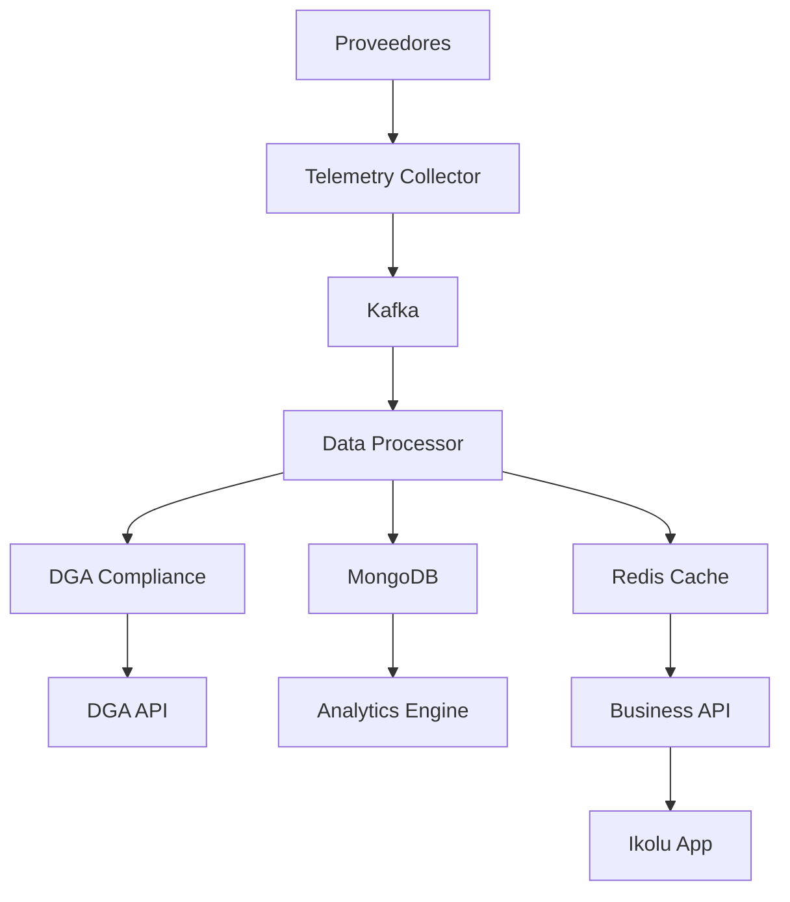

# SmartHydro Microservices Architecture

## 🎯 **Visión General**

SmartHydro 2.0 es una arquitectura de microservicios diseñada para manejar **1000+ puntos de captación** con alta disponibilidad, escalabilidad y rendimiento de nivel mundial.

## 🏗️ **Arquitectura de Servicios**

### **1. Telemetry Collector Service**

**Responsabilidad**: Recolección de datos de proveedores externos

```yaml
Puerto: 8001
Base de datos: PostgreSQL (configuración)
Message Queue: Kafka
Cache: Redis
Replicas: 3-5
```

**Funciones principales**:

- ✅ Recolección de datos de Twin Data, Nettra, Novus
- ✅ Validación básica de datos
- ✅ Transformación de formatos
- ✅ Publicación a Kafka
- ✅ Health checks de proveedores

### **2. DGA Compliance Service**

**Responsabilidad**: Cumplimiento normativo con DGA

```yaml
Puerto: 8002
Base de datos: PostgreSQL (configuración DGA)
Message Queue: Kafka
Replicas: 2-3
```

**Funciones principales**:

- ✅ Procesamiento de datos para DGA
- ✅ Validación de cumplimiento por estándar
- ✅ Envío automático a DGA
- ✅ Gestión de certificados
- ✅ Programación de envíos

### **3. Data Processor Service**

**Responsabilidad**: Procesamiento y validación de datos

```yaml
Puerto: 8003
Base de datos: MongoDB (datos de medición)
Cache: Redis
Message Queue: Kafka
Replicas: 3-5
```

**Funciones principales**:

- ✅ Procesamiento de caudal, nivel, totalizado
- ✅ Validación de calidad de datos
- ✅ Detección de anomalías
- ✅ Agregaciones (hora, día, mes)
- ✅ Almacenamiento en MongoDB

### **4. Business API Service**

**Responsabilidad**: Gestión de negocio y usuarios

```yaml
Puerto: 8004
Base de datos: PostgreSQL (datos de negocio)
Cache: Redis
Replicas: 2-3
```

**Funciones principales**:

- ✅ Gestión de usuarios y clientes
- ✅ Configuración de puntos de captación
- ✅ Sistema de módulos Ikolu
- ✅ Notificaciones y alertas
- ✅ Gestión empresarial (tareas, cotizaciones)

### **5. Analytics Engine Service**

**Responsabilidad**: Análisis y reportes

```yaml
Puerto: 8005
Base de datos: MongoDB (datos históricos)
Cache: Redis
Replicas: 2-3
```

**Funciones principales**:

- ✅ Análisis de datos históricos
- ✅ Machine Learning para predicciones
- ✅ Generación de reportes
- ✅ Dashboards en tiempo real
- ✅ Detección de tendencias

## 🔄 **Flujo de Datos**



## 📊 **Base de Datos**

### **PostgreSQL (Business Data)**

```sql
-- Configuración y gestión de negocio
- users, clients, projects
- catchment_points, configurations
- modules, subscriptions
- notifications, tasks, quotes
- permissions, audit_logs
- dga_configurations
```

### **MongoDB (Measurement Data)**

```javascript
// Datos de medición optimizados
{
  "_id": ObjectId,
  "point_id": "uuid",
  "timestamp": ISODate,
  "measurements": {
    "flow": { value: 150.5, unit: "l/s", quality: 0.99 },
    "level": { value: 25.3, unit: "m", quality: 0.98 },
    "total": { value: 1250.7, unit: "m3", quality: 0.99 }
  },
  "metadata": {
    "provider": "twin",
    "frequency": "60",
    "validation_score": 0.99,
    "anomaly_detected": false
  }
}
```

### **Redis (Cache + Real-time)**

```redis
# Streams para datos en tiempo real
XADD measurements:point_123 * flow 150.5 level 25.3 total 1250.7

# Cache para configuraciones
SET config:point_123 '{"frequency": "60", "providers": ["twin"]}'

# Colas de procesamiento
LPUSH telemetry_queue '{"point_id": "123", "data": {...}}'
```

## 🚀 **Escalabilidad**

### **Horizontal Pod Autoscaler (HPA)**

```yaml
# Configuración de auto-scaling
Telemetry Collector:
  - minReplicas: 3
  - maxReplicas: 10
  - targetCPUUtilization: 70%

Data Processor:
  - minReplicas: 3
  - maxReplicas: 8
  - targetCPUUtilization: 70%

Business API:
  - minReplicas: 2
  - maxReplicas: 5
  - targetCPUUtilization: 70%
```

### **Resource Limits**

```yaml
Telemetry Collector:
  - CPU: 2 cores
  - Memory: 4GB

Data Processor:
  - CPU: 2 cores
  - Memory: 4GB

Business API:
  - CPU: 1 core
  - Memory: 2GB
```

## 🔧 **Tecnologías Utilizadas**

### **Backend**

- **FastAPI**: Telemetry Collector, Data Processor, Analytics Engine
- **Django + DRF**: Business API
- **Celery**: Tareas asíncronas
- **Redis**: Cache y message broker
- **Kafka**: Event streaming
- **PostgreSQL**: Datos de negocio
- **MongoDB**: Datos de medición

### **Monitoring**

- **Prometheus**: Métricas
- **Grafana**: Dashboards
- **Jaeger**: Distributed tracing
- **ELK Stack**: Logs

### **Infrastructure**

- **Docker**: Containerización
- **Kubernetes**: Orchestration
- **Helm**: Package management
- **Istio**: Service mesh

## 📈 **Performance Targets**

### **Latencia**

- Telemetry Collection: < 100ms
- Data Processing: < 500ms
- Business API: < 200ms
- Analytics: < 2s

### **Throughput**

- 1000 puntos de captación
- 73 mediciones/hora por punto
- Total: 73,000 mediciones/hora
- Pico: 100,000 mediciones/hora

### **Availability**

- 99.9% uptime
- RTO: < 5 minutos
- RPO: < 1 minuto

## 🔒 **Seguridad**

### **Authentication**

- JWT tokens
- OAuth 2.0 para proveedores
- API keys para servicios internos

### **Authorization**

- RBAC (Role-Based Access Control)
- Service-to-service authentication
- Network policies

### **Data Protection**

- Encryption at rest
- Encryption in transit (TLS)
- Data anonymization
- Audit logging

## 📚 **APIs**

### **Telemetry Collector API**

```yaml
GET /health                    # Health check
GET /providers                 # Lista proveedores
POST /collect/{provider}       # Recolectar datos
GET /status/{provider}         # Estado proveedor
```

### **Business API**

```yaml
GET /api/v1/clients/           # Lista clientes
POST /api/v1/clients/          # Crear cliente
GET /api/v1/points/            # Lista puntos
POST /api/v1/points/           # Crear punto
PUT /api/v1/points/{id}/config # Configurar punto
GET /api/v1/modules/           # Módulos disponibles
POST /api/v1/notifications/    # Crear notificación
```

### **Analytics API**

```yaml
GET /api/v1/analytics/points/{id}/history    # Histórico
GET /api/v1/analytics/points/{id}/realtime   # Tiempo real
POST /api/v1/analytics/reports               # Generar reporte
GET /api/v1/analytics/anomalies              # Anomalías
```

## 🎯 **Próximos Pasos**

1. **Implementar Telemetry Collector**
2. **Configurar Kafka y Redis**
3. **Implementar Data Processor**
4. **Migrar Business API**
5. **Implementar Analytics Engine**
6. **Configurar monitoring**
7. **Deploy en Kubernetes**

## 📖 **Recursos de Aprendizaje**

### **Microservicios**

- [Microservices.io](https://microservices.io/)
- [Martin Fowler - Microservices](https://martinfowler.com/articles/microservices.html)

### **Kubernetes**

- [Kubernetes.io](https://kubernetes.io/)
- [Kubernetes by Example](https://kubernetesbyexample.com/)

### **Apache Kafka**

- [Kafka.apache.org](https://kafka.apache.org/)
- [Confluent Platform](https://www.confluent.io/)

### **MongoDB**

- [MongoDB.com](https://www.mongodb.com/)
- [MongoDB University](https://university.mongodb.com/)

### **Redis**

- [Redis.io](https://redis.io/)
- [Redis University](https://university.redis.com/)
