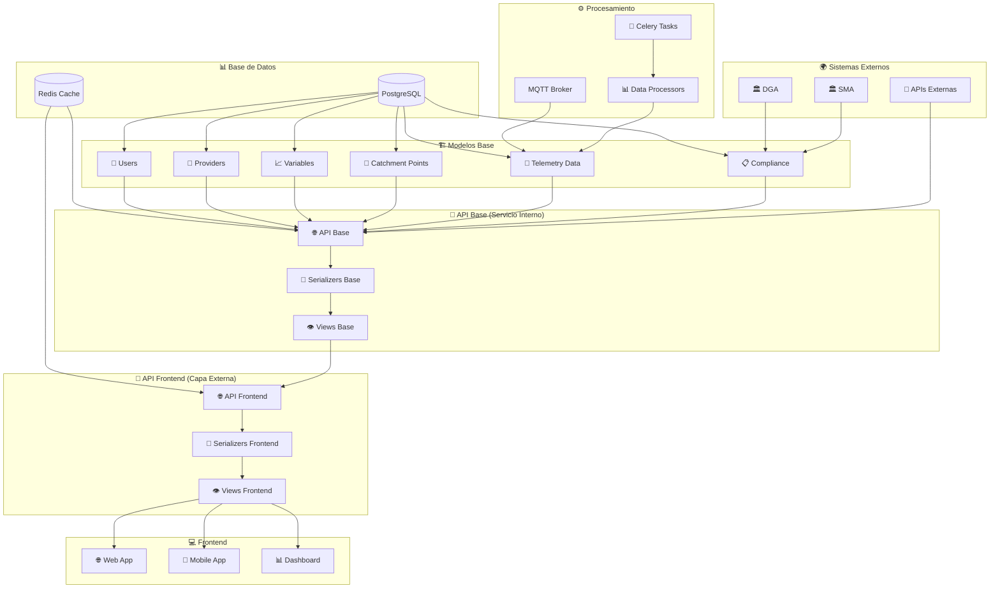
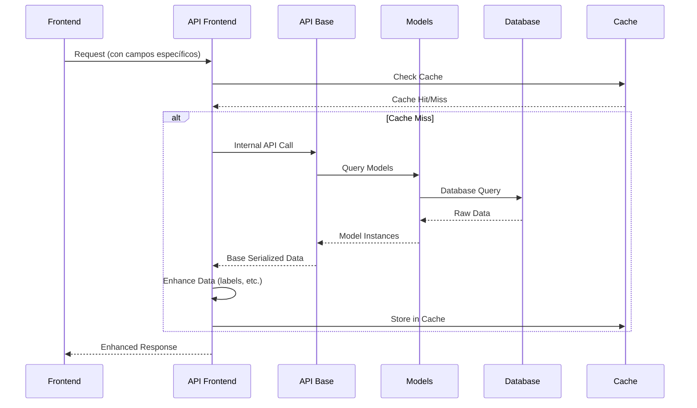

# 🏗️ Arquitectura del Sistema Completo

## 📊 Diagrama General del Sistema



## 🎯 Arquitectura de Dos Capas

### **Capa 1: API Base (Servicio Interno)**

```python
# api/apps/core/api/base/
├── serializers/
│   ├── base_serializers.py      # Serializers base sin lógica de frontend
│   └── common.py               # Funcionalidades comunes
├── views/
│   ├── base_viewsets.py        # ViewSets base
│   └── common.py               # Funcionalidades comunes
└── endpoints/
    ├── variables/
    ├── catchment/
    ├── telemetry/
    └── compliance/
```

### **Capa 2: API Frontend (Capa Externa)**

```python
# api/apps/frontend/api/
├── serializers/
│   ├── frontend_serializers.py  # Serializers con lógica de frontend
│   └── enhanced.py             # Campos adicionales (labels, etc.)
├── views/
│   ├── frontend_viewsets.py    # ViewSets optimizados para frontend
│   └── cache.py                # Lógica de caché
└── endpoints/
    ├── dashboard/
    ├── mobile/
    └── web/
```

## 🔄 Flujo de Datos



## 📋 Estructura de Variables con Esquemas

### **Modelo de Esquema**

```python
class VariableSchema(BaseModel):
    """Esquema de variables reutilizable"""
    name = models.CharField(max_length=100)
    code = models.CharField(max_length=50, unique=True)

    # Variables del esquema
    variables = models.JSONField(default=list)

    # Configuración del esquema
    config = models.JSONField(default=dict)

    # Labels para frontend (opcional)
    frontend_labels = models.JSONField(default=dict)
```

### **Configuración de Variables por Punto**

```python
class CatchmentPointVariableConfig(BaseModel):
    """Configuración específica de variables por punto"""
    catchment_point = models.ForeignKey(CatchmentPoint, ...)
    schema = models.ForeignKey(VariableSchema, ...)

    # Configuración específica
    custom_config = models.JSONField(default=dict)

    # Labels específicos para este punto
    custom_labels = models.JSONField(default=dict)

    # Reglas de alerta
    alert_rules = models.JSONField(default=dict)
```

## 🎨 Implementación de las Dos Capas

### **Capa 1: API Base (Sin Lógica de Frontend)**

#### **Serializers Base**

```python
# api/apps/core/api/base/serializers/base_serializers.py
from rest_framework import serializers
from api.apps.variables.models import Variable, VariableSchema

class VariableBaseSerializer(serializers.ModelSerializer):
    """Serializer base para variables (sin lógica de frontend)"""

    class Meta:
        model = Variable
        fields = [
            'id', 'name', 'code', 'variable_type', 'unit',
            'processing_config', 'min_value', 'max_value',
            'is_active', 'created_at', 'updated_at'
        ]
        read_only_fields = ['id', 'created_at', 'updated_at']

class VariableSchemaBaseSerializer(serializers.ModelSerializer):
    """Serializer base para esquemas de variables"""

    class Meta:
        model = VariableSchema
        fields = [
            'id', 'name', 'code', 'variables', 'config',
            'is_active', 'created_at', 'updated_at'
        ]
        read_only_fields = ['id', 'created_at', 'updated_at']
```

#### **Views Base**

```python
# api/apps/core/api/base/views/base_viewsets.py
from rest_framework import viewsets
from api.apps.variables.models import Variable, VariableSchema
from ..serializers.base_serializers import (
    VariableBaseSerializer, VariableSchemaBaseSerializer
)

class VariableBaseViewSet(viewsets.ModelViewSet):
    """ViewSet base para variables (API interna)"""

    queryset = Variable.objects.filter(is_active=True)
    serializer_class = VariableBaseSerializer

    def get_queryset(self):
        queryset = super().get_queryset()

        # Filtros básicos
        variable_type = self.request.query_params.get('variable_type')
        if variable_type:
            queryset = queryset.filter(variable_type=variable_type)

        return queryset

class VariableSchemaBaseViewSet(viewsets.ModelViewSet):
    """ViewSet base para esquemas de variables"""

    queryset = VariableSchema.objects.filter(is_active=True)
    serializer_class = VariableSchemaBaseSerializer
```

### **Capa 2: API Frontend (Con Lógica de Frontend)**

#### **Serializers Frontend**

```python
# api/apps/frontend/api/serializers/frontend_serializers.py
from rest_framework import serializers
from api.apps.core.api.base.serializers.base_serializers import (
    VariableBaseSerializer, VariableSchemaBaseSerializer
)

class VariableFrontendSerializer(VariableBaseSerializer):
    """Serializer para frontend con campos adicionales"""

    # Campos adicionales para frontend
    display_name = serializers.SerializerMethodField()
    unit_display = serializers.SerializerMethodField()
    status_display = serializers.SerializerMethodField()

    def get_display_name(self, obj):
        """Obtener nombre para mostrar (con label personalizado)"""
        # Lógica para obtener label personalizado
        return obj.name

    def get_unit_display(self, obj):
        """Obtener unidad formateada para frontend"""
        if obj.unit == 'CUSTOM' and obj.custom_unit:
            return obj.custom_unit
        return obj.get_unit_display()

    def get_status_display(self, obj):
        """Obtener estado formateado para frontend"""
        return "Activa" if obj.is_active else "Inactiva"

class VariableSchemaFrontendSerializer(VariableSchemaBaseSerializer):
    """Serializer para frontend con esquemas"""

    # Campos adicionales para frontend
    variables_count = serializers.SerializerMethodField()
    is_configured = serializers.SerializerMethodField()

    def get_variables_count(self, obj):
        """Contar variables en el esquema"""
        return len(obj.variables) if obj.variables else 0

    def get_is_configured(self, obj):
        """Verificar si el esquema está configurado"""
        return bool(obj.config and obj.variables)
```

#### **Views Frontend**

```python
# api/apps/frontend/api/views/frontend_viewsets.py
from rest_framework import viewsets
from rest_framework.decorators import action
from rest_framework.response import Response
from django.core.cache import cache
from api.apps.core.api.base.views.base_viewsets import (
    VariableBaseViewSet, VariableSchemaBaseViewSet
)
from ..serializers.frontend_serializers import (
    VariableFrontendSerializer, VariableSchemaFrontendSerializer
)

class VariableFrontendViewSet(VariableBaseViewSet):
    """ViewSet para frontend con caché y optimizaciones"""

    serializer_class = VariableFrontendSerializer

    def get_queryset(self):
        """Queryset optimizado para frontend"""
        queryset = super().get_queryset()

        # Optimizaciones específicas para frontend
        queryset = queryset.select_related()

        return queryset

    @action(detail=False, methods=['get'])
    def dashboard_summary(self, request):
        """Endpoint específico para dashboard"""
        cache_key = f"variables_dashboard_summary_{request.user.id}"
        cached_data = cache.get(cache_key)

        if cached_data:
            return Response(cached_data)

        # Lógica específica para dashboard
        data = {
            'total_variables': self.get_queryset().count(),
            'active_variables': self.get_queryset().filter(is_active=True).count(),
            'variables_by_type': self.get_variables_by_type(),
        }

        # Cache por 5 minutos
        cache.set(cache_key, data, 300)

        return Response(data)

    def get_variables_by_type(self):
        """Obtener variables agrupadas por tipo"""
        from django.db.models import Count
        return self.get_queryset().values('variable_type').annotate(
            count=Count('id')
        )

class VariableSchemaFrontendViewSet(VariableSchemaBaseViewSet):
    """ViewSet para esquemas en frontend"""

    serializer_class = VariableSchemaFrontendSerializer

    @action(detail=True, methods=['post'])
    def assign_to_catchment_point(self, request, pk=None):
        """Asignar esquema a punto de captación"""
        schema = self.get_object()
        catchment_point_id = request.data.get('catchment_point_id')

        # Lógica para asignar esquema
        # ...

        return Response({'status': 'assigned'})
```

## 🔧 URLs y Enrutamiento

### **URLs Base (API Interna)**

```python
# api/config/urls/base.py
from django.urls import path, include
from api.apps.core.api.base.views.base_viewsets import (
    VariableBaseViewSet, VariableSchemaBaseViewSet
)

base_router = DefaultRouter()
base_router.register(r'variables', VariableBaseViewSet, basename='base-variables')
base_router.register(r'schemas', VariableSchemaBaseViewSet, basename='base-schemas')

urlpatterns = [
    path('api/base/', include(base_router.urls)),
]
```

### **URLs Frontend (API Externa)**

```python
# api/config/urls/frontend.py
from django.urls import path, include
from api.apps.frontend.api.views.frontend_viewsets import (
    VariableFrontendViewSet, VariableSchemaFrontendViewSet
)

frontend_router = DefaultRouter()
frontend_router.register(r'variables', VariableFrontendViewSet, basename='frontend-variables')
frontend_router.register(r'schemas', VariableSchemaFrontendViewSet, basename='frontend-schemas')

urlpatterns = [
    path('api/frontend/', include(frontend_router.urls)),
    path('api/dashboard/', include('api.apps.frontend.api.endpoints.dashboard.urls')),
    path('api/mobile/', include('api.apps.frontend.api.endpoints.mobile.urls')),
]
```

## 📊 Ejemplo de Uso Completo

### **1. Crear Esquema Base**

```python
# API Base
POST /api/base/schemas/
{
    "name": "Esquema Pozo Estándar",
    "code": "POZO_STANDARD",
    "variables": [
        {"code": "NIVEL_001", "required": true},
        {"code": "CAUDAL_001", "required": true},
        {"code": "TEMPERATURA_001", "required": false}
    ],
    "config": {
        "sampling_frequency": 60,
        "data_retention_days": 365
    }
}
```

### **2. Asignar Esquema a Punto de Captación**

```python
# API Frontend
POST /api/frontend/schemas/{schema_id}/assign_to_catchment_point/
{
    "catchment_point_id": 123,
    "custom_config": {
        "level_position": 10.5,
        "alert_threshold": 80.0
    },
    "custom_labels": {
        "NIVEL_001": "Nivel de Agua del Pozo",
        "CAUDAL_001": "Caudal de Extracción"
    }
}
```

### **3. Consultar Datos para Frontend**

```python
# API Frontend con caché
GET /api/frontend/variables/?variable_type=NIVEL

# Respuesta con campos adicionales
{
    "count": 5,
    "results": [
        {
            "id": 1,
            "name": "Nivel de Agua",
            "code": "NIVEL_001",
            "display_name": "Nivel de Agua del Pozo",
            "unit_display": "metros",
            "status_display": "Activa",
            "variable_type": "NIVEL",
            "is_active": true
        }
    ]
}
```

## 🎯 Beneficios de esta Arquitectura

### **✅ Para el Sistema Base:**

- API estable para servicios internos
- Sin dependencias de frontend
- Fácil testing y mantenimiento
- Cache independiente

### **✅ Para el Frontend:**

- Flexibilidad total en serializers
- Campos adicionales (labels, etc.)
- Optimizaciones específicas
- Cache separado

### **✅ Para el Desarrollo:**

- Separación clara de responsabilidades
- Fácil evolución independiente
- Testing aislado
- Deployment independiente

## 🚀 Próximos Pasos

1. **Implementar estructura de carpetas**
2. **Crear serializers base**
3. **Crear serializers frontend**
4. **Implementar sistema de caché**
5. **Configurar URLs**
6. **Crear documentación de API**

¿Te gustaría que implemente esta arquitectura paso a paso?
