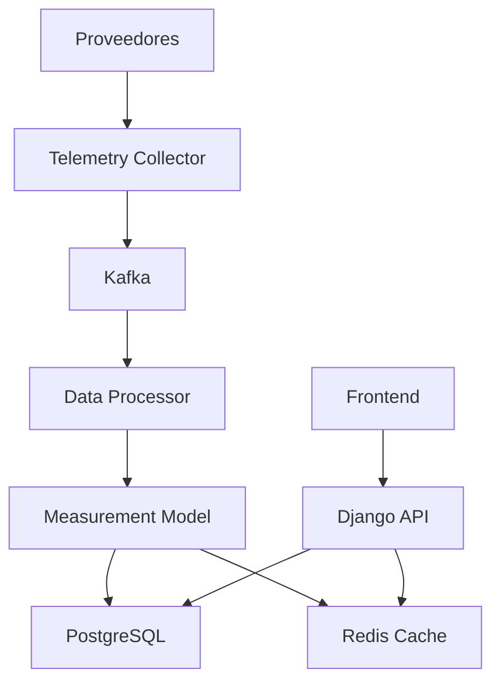

# 📚 Guía de Uso - API de Telemetría Unificada

## 🎯 **Descripción General**

Esta guía describe cómo usar la nueva API unificada de telemetría que reemplaza los modelos anteriores (`InteractionDetail` y `TimeSeriesData`) con un sistema más eficiente y consistente.

## 🏗️ **Arquitectura del Sistema**



## 📋 **Endpoints Principales**

### **1. Mediciones (`/api/telemetry/measurements/`)**

#### **Obtener Mediciones**

```bash
GET /api/telemetry/measurements/
```

**Parámetros de consulta:**

- `point_id`: ID del punto de captación
- `variable_id`: ID de la variable
- `provider`: Proveedor (twin, nettra, novus)
- `start_date`: Fecha de inicio (ISO 8601)
- `end_date`: Fecha de fin (ISO 8601)
- `quality_min`: Calidad mínima (0.0 - 1.0)
- `limit`: Límite de resultados (default: 1000)
- `offset`: Offset para paginación

**Ejemplo:**

```bash
curl -X GET "http://localhost:8000/api/telemetry/measurements/?point_id=1&start_date=2024-01-01T00:00:00Z&limit=100"
```

**Respuesta:**

```json
{
  "count": 100,
  "next": "http://localhost:8000/api/telemetry/measurements/?page=2",
  "previous": null,
  "results": [
    {
      "id": 1,
      "point": 1,
      "point_name": "Punto Test",
      "variable": 1,
      "variable_name": "level",
      "variable_label": "Nivel de Agua",
      "variable_unit": "m",
      "timestamp": "2024-01-01T12:00:00Z",
      "value_numeric": 12.34,
      "value_text": null,
      "value_boolean": null,
      "raw_value": {
        "original_value": 12.34,
        "provider_data": {}
      },
      "quality_score": 0.95,
      "provider": "twin",
      "processing_config": {
        "pulse_factor": 1000,
        "unit_conversion": "m"
      },
      "days_since_last_connection": 0,
      "created_at": "2024-01-01T12:00:00Z",
      "updated_at": "2024-01-01T12:00:00Z"
    }
  ]
}
```

#### **Crear Medición Individual**

```bash
POST /api/telemetry/measurements/
```

**Body:**

```json
{
  "point": 1,
  "variable": 1,
  "timestamp": "2024-01-01T12:00:00Z",
  "value_numeric": 12.34,
  "raw_value": {
    "original_value": 12.34,
    "provider_data": {}
  },
  "provider": "twin",
  "quality_score": 0.95,
  "processing_config": {},
  "days_since_last_connection": 0
}
```

#### **Crear Múltiples Mediciones**

```bash
POST /api/telemetry/measurements/bulk_create/
```

**Body:**

```json
{
  "measurements": [
    {
      "point": 1,
      "variable": 1,
      "timestamp": "2024-01-01T12:00:00Z",
      "value_numeric": 12.34,
      "provider": "twin",
      "quality_score": 0.95
    },
    {
      "point": 1,
      "variable": 2,
      "timestamp": "2024-01-01T12:00:00Z",
      "value_numeric": 45.67,
      "provider": "twin",
      "quality_score": 0.98
    }
  ],
  "batch_id": "batch_20240101_001",
  "provider": "twin",
  "frequency": "60"
}
```

#### **Obtener Estadísticas**

```bash
GET /api/telemetry/measurements/stats/
```

**Respuesta:**

```json
{
  "total_measurements": 15000,
  "measurements_today": 1440,
  "measurements_this_week": 10080,
  "measurements_this_month": 43200,
  "by_provider": {
    "twin": 8000,
    "nettra": 5000,
    "novus": 2000
  },
  "by_variable": {
    "level": {
      "count": 5000,
      "avg_quality": 0.95
    },
    "flow": {
      "count": 5000,
      "avg_quality": 0.92
    },
    "total": {
      "count": 5000,
      "avg_quality": 0.98
    }
  },
  "quality_stats": {
    "avg_quality": 0.95,
    "min_quality": 0.1,
    "max_quality": 1.0
  },
  "processing_stats": {
    "total_batches": 100,
    "completed_batches": 95,
    "avg_processing_time": 1500
  }
}
```

#### **Serie Temporal**

```bash
POST /api/telemetry/measurements/time_series/
```

**Body:**

```json
{
  "variable_id": 1,
  "point_id": 1,
  "start_date": "2024-01-01T00:00:00Z",
  "end_date": "2024-01-02T00:00:00Z",
  "interval": "1h",
  "aggregation": "avg"
}
```

**Respuesta:**

```json
{
  "variable_id": 1,
  "start_date": "2024-01-01T00:00:00Z",
  "end_date": "2024-01-02T00:00:00Z",
  "interval": "1h",
  "aggregation": "avg",
  "measurements": [
    {
      "timestamp": "2024-01-01T00:00:00Z",
      "value_numeric": 12.34,
      "quality_score": 0.95
    }
  ]
}
```

#### **Exportar Datos**

```bash
POST /api/telemetry/measurements/export/
```

**Body:**

```json
{
  "format": "csv",
  "point_ids": [1, 2, 3],
  "variable_ids": [1, 2],
  "start_date": "2024-01-01T00:00:00Z",
  "end_date": "2024-01-31T23:59:59Z",
  "include_raw_data": false,
  "include_quality_metrics": true
}
```

### **2. Puntos de Captación (`/api/telemetry/points/`)**

#### **Obtener Puntos**

```bash
GET /api/telemetry/points/
```

**Parámetros:**

- `project_id`: ID del proyecto
- `is_telemetry_active`: Estado de telemetría (true/false)
- `frequency`: Frecuencia de recolección

#### **Obtener Mediciones de un Punto**

```bash
GET /api/telemetry/points/{id}/measurements/
```

#### **Activar Telemetría**

```bash
POST /api/telemetry/points/{id}/activate/
```

#### **Desactivar Telemetría**

```bash
POST /api/telemetry/points/{id}/deactivate/
```

### **3. Variables (`/api/telemetry/variables/`)**

#### **Obtener Variables**

```bash
GET /api/telemetry/variables/
```

**Parámetros:**

- `scheme_id`: ID del esquema
- `provider`: Proveedor
- `variable_type`: Tipo de variable

#### **Obtener Mediciones de una Variable**

```bash
GET /api/telemetry/variables/{id}/measurements/
```

### **4. Esquemas (`/api/telemetry/schemes/`)**

#### **Asignar Esquema a Puntos**

```bash
POST /api/telemetry/schemes/{id}/assign/
```

**Body:**

```json
{
  "point_ids": [1, 2, 3]
}
```

#### **Remover Esquema de Puntos**

```bash
POST /api/telemetry/schemes/{id}/remove/
```

**Body:**

```json
{
  "point_ids": [1, 2, 3]
}
```

### **5. Lotes (`/api/telemetry/batches/`)**

#### **Obtener Lotes**

```bash
GET /api/telemetry/batches/
```

**Parámetros:**

- `provider`: Proveedor
- `status`: Estado del lote

#### **Estadísticas de Lotes**

```bash
GET /api/telemetry/batches/stats/
```

### **6. Calidad (`/api/telemetry/quality/`)**

#### **Obtener Métricas de Calidad**

```bash
GET /api/telemetry/quality/
```

**Parámetros:**

- `is_outlier`: Filtrar outliers
- `is_missing`: Filtrar datos faltantes

## 🔧 **Configuración y Uso**

### **1. Configuración de Variables**

```python
# Crear una variable
variable_data = {
    "scheme": 1,
    "name": "level",
    "label": "Nivel de Agua",
    "variable_type": "LEVEL",
    "provider": "TWIN",
    "unit": "m",
    "pulse_factor": 1000,
    "constant_addition": 0
}

response = requests.post(
    "http://localhost:8000/api/telemetry/variables/",
    json=variable_data,
    headers={"Authorization": "Bearer YOUR_TOKEN"}
)
```

### **2. Configuración de Puntos**

```python
# Activar telemetría en un punto
response = requests.post(
    "http://localhost:8000/api/telemetry/points/1/activate/",
    headers={"Authorization": "Bearer YOUR_TOKEN"}
)
```

### **3. Consultas Avanzadas**

#### **Mediciones de Alta Calidad**

```bash
curl -X GET "http://localhost:8000/api/telemetry/measurements/?quality_min=0.9&provider=twin"
```

#### **Mediciones por Rango de Fechas**

```bash
curl -X GET "http://localhost:8000/api/telemetry/measurements/?start_date=2024-01-01T00:00:00Z&end_date=2024-01-31T23:59:59Z"
```

#### **Mediciones de un Punto Específico**

```bash
curl -X GET "http://localhost:8000/api/telemetry/points/1/measurements/?variable_id=1&limit=1000"
```

## 📊 **Ejemplos de Uso**

### **1. Dashboard de Monitoreo**

```javascript
// Obtener estadísticas para dashboard
async function getDashboardStats() {
  const response = await fetch("/api/telemetry/measurements/stats/");
  const stats = await response.json();

  // Actualizar UI
  document.getElementById("total-measurements").textContent =
    stats.total_measurements;
  document.getElementById("measurements-today").textContent =
    stats.measurements_today;

  // Gráfico por proveedor
  const providerChart = new Chart(ctx, {
    data: {
      labels: Object.keys(stats.by_provider),
      datasets: [
        {
          data: Object.values(stats.by_provider),
        },
      ],
    },
  });
}
```

### **2. Gráfico de Serie Temporal**

```javascript
// Obtener serie temporal para gráfico
async function getTimeSeries(variableId, startDate, endDate) {
  const response = await fetch("/api/telemetry/measurements/time_series/", {
    method: "POST",
    headers: {
      "Content-Type": "application/json",
      Authorization: "Bearer YOUR_TOKEN",
    },
    body: JSON.stringify({
      variable_id: variableId,
      start_date: startDate,
      end_date: endDate,
      interval: "1h",
      aggregation: "avg",
    }),
  });

  const data = await response.json();

  // Crear gráfico
  const chart = new Chart(ctx, {
    type: "line",
    data: {
      labels: data.measurements.map((m) => m.timestamp),
      datasets: [
        {
          label: "Nivel de Agua",
          data: data.measurements.map((m) => m.value_numeric),
        },
      ],
    },
  });
}
```

### **3. Exportación de Datos**

```javascript
// Exportar datos para análisis
async function exportData() {
  const response = await fetch("/api/telemetry/measurements/export/", {
    method: "POST",
    headers: {
      "Content-Type": "application/json",
      Authorization: "Bearer YOUR_TOKEN",
    },
    body: JSON.stringify({
      format: "csv",
      point_ids: [1, 2, 3],
      start_date: "2024-01-01T00:00:00Z",
      end_date: "2024-01-31T23:59:59Z",
      include_quality_metrics: true,
    }),
  });

  const result = await response.json();

  // Descargar archivo
  window.location.href = result.download_url;
}
```

## 🚨 **Manejo de Errores**

### **Códigos de Error Comunes**

- `400 Bad Request`: Parámetros inválidos
- `401 Unauthorized`: Token de autenticación requerido
- `403 Forbidden`: Permisos insuficientes
- `404 Not Found`: Recurso no encontrado
- `429 Too Many Requests`: Límite de rate excedido
- `500 Internal Server Error`: Error interno del servidor

### **Ejemplo de Manejo de Errores**

```javascript
async function handleApiCall(url, options = {}) {
  try {
    const response = await fetch(url, {
      headers: {
        Authorization: "Bearer YOUR_TOKEN",
        "Content-Type": "application/json",
        ...options.headers,
      },
      ...options,
    });

    if (!response.ok) {
      const error = await response.json();
      throw new Error(`API Error: ${error.detail || error.message}`);
    }

    return await response.json();
  } catch (error) {
    console.error("API call failed:", error);
    // Mostrar mensaje de error al usuario
    showErrorMessage(error.message);
  }
}
```

## 🔒 **Autenticación y Seguridad**

### **Tokens JWT**

```bash
# Obtener token
curl -X POST "http://localhost:8000/api/auth/login/" \
  -H "Content-Type: application/json" \
  -d '{"username": "user", "password": "password"}'

# Usar token
curl -X GET "http://localhost:8000/api/telemetry/measurements/" \
  -H "Authorization: Bearer YOUR_TOKEN"
```

### **Permisos**

- **Lectura**: Usuarios autenticados pueden leer mediciones
- **Escritura**: Solo administradores pueden crear/modificar mediciones
- **Eliminación**: Solo superusuarios pueden eliminar mediciones

## 📈 **Optimización y Rendimiento**

### **Índices Optimizados**

El sistema incluye índices optimizados para consultas frecuentes:

- `(point, variable, timestamp)`: Consultas por punto y variable
- `(timestamp)`: Consultas por tiempo
- `(provider, timestamp)`: Consultas por proveedor
- `(variable, timestamp)`: Consultas por variable

### **Cache**

- **Redis**: Cache de consultas frecuentes
- **TTL**: 30 minutos para configuraciones
- **Invalidación**: Automática al modificar datos

### **Paginación**

```bash
# Primera página
GET /api/telemetry/measurements/?limit=100

# Siguiente página
GET /api/telemetry/measurements/?limit=100&offset=100
```

## 🧪 **Testing**

### **Script de Testing**

```bash
# Ejecutar pruebas del sistema
python scripts/test_telemetry_system.py
```

### **Pruebas Manuales**

```bash
# Health check
curl http://localhost:8001/health

# Stats del collector
curl http://localhost:8001/stats

# Stats del processor
curl http://localhost:8003/stats

# API de Django
curl http://localhost:8000/api/telemetry/measurements/stats/
```

## 📞 **Soporte**

Para soporte técnico o reportar problemas:

1. **Documentación**: Revisar esta guía
2. **Logs**: Verificar logs de los servicios
3. **Testing**: Ejecutar script de pruebas
4. **Issues**: Crear issue en el repositorio

---

**¡El sistema está listo para manejar millones de mediciones con máxima eficiencia! 🚀**
